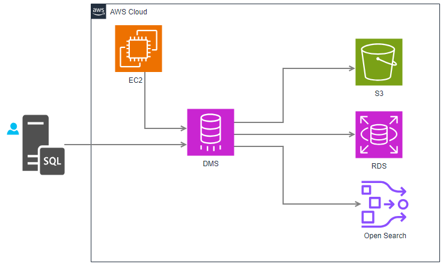

## Desenho da arquitetura

O diagrama mostra uma arquitetura de migração de dados utilizando o AWS Database Migration Service (DMS) para mover dados de um banco de dados SQL on-premise para diferentes destinos na AWS.

### Descrição da Arquitetura:
1. Fonte (Banco SQL): 
* O banco de dados SQL on-premise é o ponto de origem dos dados a serem migrados. Ele pode ser um banco MySQL, Oracle, SQL Server, entre outros.

2. AWS DMS (Database Migration Service): 
* O AWS DMS é o serviço responsável por mover os dados do banco de origem para diversos destinos. Ele suporta tanto migração de dados em tempo real quanto cargas completas de dados.
* DMS também permite replicar dados continuamente, facilitando a sincronização de bancos de dados com diferentes destinos na nuvem.

3. Destinos de Migração:

* Amazon S3: O DMS pode transferir os dados do banco de dados SQL para o Amazon S3, onde os dados podem ser armazenados em arquivos, como no formato Parquet ou CSV, para análise ou arquivamento.
* Amazon RDS: DMS pode também migrar os dados para o Amazon RDS (Relational Database Service), que oferece opções de bancos de dados gerenciados como MySQL, PostgreSQL, Oracle e SQL Server.
* Amazon OpenSearch: A arquitetura suporta a migração de dados para o Amazon OpenSearch (anteriormente Elasticsearch) para realizar buscas e análises avançadas em tempo real.

4. EC2:

* Uma instância do Amazon EC2 está presente para dar suporte ao DMS, podendo estar configurada como parte do processo de configuração do DMS ou como um ponto de origem dos dados.

### Fluxo de Dados:
* Os dados do banco SQL são extraídos pela instância do DMS, que então os distribui para os destinos configurados: Amazon S3 para armazenamento de objetos, Amazon RDS para bancos de dados gerenciados, e Amazon OpenSearch para indexação e consultas de busca. 

Este diagrama ilustra uma arquitetura de migração robusta e flexível, adequada para ambientes que precisam integrar diferentes serviços AWS e suportar a migração contínua ou em tempo real de dados para a nuvem.

### Links:

https://medium.com/@iamvijaykishan/building-a-search-application-using-aws-opensearch-c4e35c153ada

https://moosakhalid.medium.com/from-mysql-to-mysql-rds-using-aws-dms-to-migrate-your-databases-to-aws-via-terraform-44fe2fea3e47

## COMANDOS
terraform init
terraform apply -auto-approve -var-file="./_variables/prd.tfvars"
terraform plan -var-file="./_variables/prd.tfvars"
terraform destroy -auto-approve -var-file="./_variables/prd.tfvars"

### Sobre AWS DMS

Mahesh Kariya - AWS DMS Database Migration Service
https://www.youtube.com/watch?v=s56vVl4DnDQ&t=21s

Cloud Treinamentos - Como Migrar um Banco de Dados em Produção para a Nuvem
https://www.youtube.com/watch?v=jzvyLO8cVA8&t=1511s
https://www.youtube.com/watch?v=nazoRNL4vpQ

https://docs.aws.amazon.com/dms/latest/userguide/fa-data-collectors-create.html

https://youtu.be/2UmTXVIlDLw  

https://www.youtube.com/watch?v=H_25R8my7-4&t=1007s

AWS Data Migration Service | Aurora MYSQL [Hands on Lab]
https://www.youtube.com/watch?v=3v3Q7WVbsT4&t=3s

Fonte: Migrate On Premise MySQL to RDS | AWS Database Migration Service | On Premise to AWS Cloud Migration - https://www.youtube.com/watch?v=H_25R8my7-4&t=1578s

    Comandos no EC2
    - sudo nano /etc/mysql/mysql.conf.d/mysqld.cnf
    - sudo systemctl restart mysql

    No DBeaver 
    - allowPublicKeyRetrieval=true